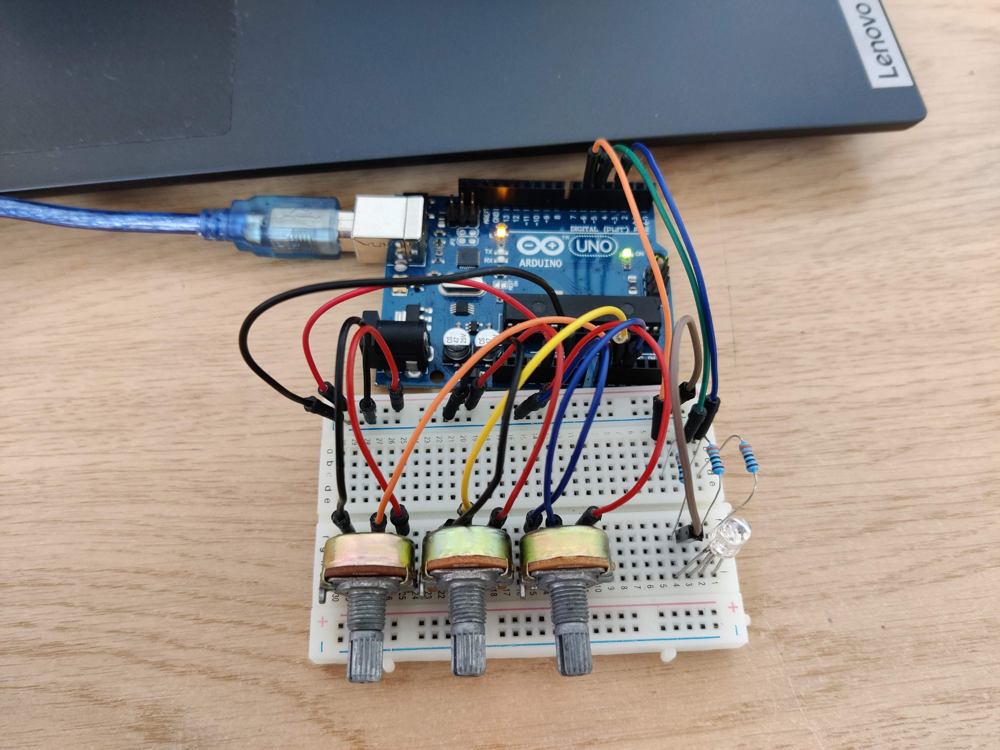

# Introduction to Robotics (2023 - 2024)

This repository contains the laboratory homeworks for the "Introduction to Robotics" course, taken in the 3rd year at the Faculty of Mathematics and Computer Science, University of Bucharest. Each homework includes requirements, implementation details, code and image files.

 	
Homework #1 - RGB LED controlled by 3 potentiometers

	<h2>Task Requirements</h2>
	Use a separate potentiometer for controlling each color of the RGB LED: Red, Green, and Blue. This control must leverage digital electronics. Specifically, you need to read the potentiometer’s value with Arduino and then write a mapped value to the LED pins.
	<h2>Photo of the setup</h2>
	
	<h2>Video</h2>
	<a href="https://youtu.be/r5gD0jrxwg8">YouTube link</a>
	

	
Homework #2 - Elevator simulator wannabe

	<h2>Task Requirements</h2>
	Design a control system that simulates a 3-floor elevator using the Arduino platform. Here are the specific requirements:
	<ul>
		<li>LED Indicators: Each of the 3 LEDs should represent one of the 3 floors. The LED corresponding to the current floor should light up. Additionally, another LED should represent the elevator’s operational state. It should blink when the elevator is moving and remain static when stationary.</li>
		<li>Buttons: Implement 3 buttons that represent the call buttons from the 3 floors. When pressed, the elevator should simulate movement towards the floor after a short interval (2-3 seconds).
		</li>
		<li>Buzzer (optional for Computer Science, mandatory for CTI): The buzzer should sound briefly during the following scenarios:
			<ul>
				<li>Elevator arriving at the desired floor (something resembling a ”cling”).</li>
				<li>Elevator doors closing and movement (pro tip: split them into 2 different sounds).</li>
			</ul>
		</li>
		<li>State Change & Timers: If the elevator is already at the desired floor, pressing the button for that floor should have no effect. Otherwise, after a button press, the elevator should ”wait for the doors to close” and then ”move” to the corresponding floor. If the elevator is in movement, it should either do nothing or it should stack its decision (get to the first programmed floor, open the doors, wait, close them and then go to the next desired floor).</li>
		<li>Debounce: Remember to implement debounce for the buttons to avoid unintentional repeated button presses.</li>
		<h2>Photo of the setup</h2>
		
		<h2>Video</h2>
		<a href="https://youtu.be/LfgWHZSbjWU">YouTube link</a>
	</ul>

