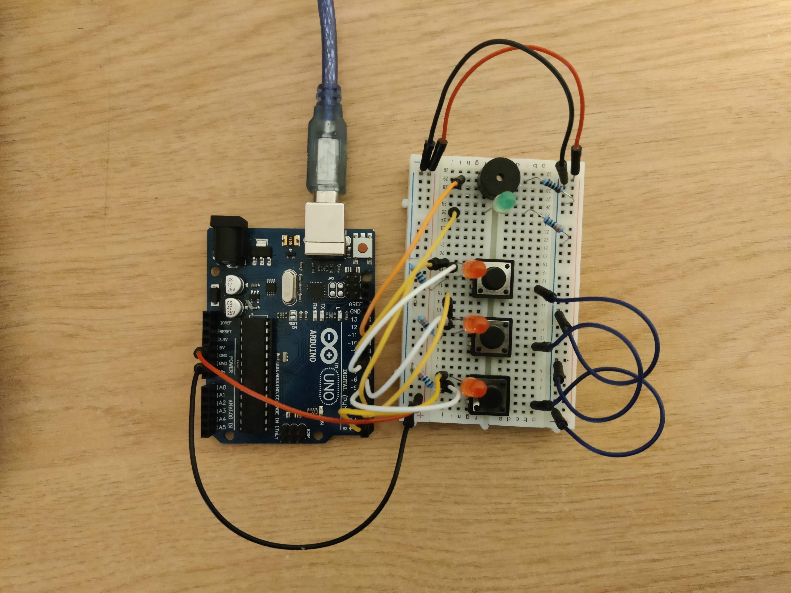

# Introduction to Robotics (2023 - 2024)

This repository contains the laboratory homeworks for the "Introduction to Robotics" course, taken in the 3rd year at the Faculty of Mathematics and Computer Science, University of Bucharest. Each homework includes requirements, implementation details, code and image files.

 	
Homework #1 - RGB LED controlled by 3 potentiometers

	<h2>Task Requirements</h2>
	Use a separate potentiometer for controlling each color of the RGB LED: Red, Green, and Blue. This control must leverage digital electronics. Specifically, you need to read the potentiometer’s value with Arduino and then write a mapped value to the LED pins.
	<h2>Photo of the setup</h2>
	
	<h2>Video</h2>
	<a href="https://youtu.be/r5gD0jrxwg8">YouTube link</a>
	

Homework #2 - Elevator simulator wannabe

	<h2>Task Requirements</h2>
	Design a control system that simulates a 3-floor elevator using the Arduino platform. Here are the specific requirements:
	<ul>
		<li>LED Indicators: Each of the 3 LEDs should represent one of the 3 floors. The LED corresponding to the current floor should light up. Additionally, another LED should represent the elevator’s operational state. It should blink when the elevator is moving and remain static when stationary.</li>
		<li>Buttons: Implement 3 buttons that represent the call buttons from the 3 floors. When pressed, the elevator should simulate movement towards the floor after a short interval (2-3 seconds).
		</li>
		<li>Buzzer (optional for Computer Science, mandatory for CTI): The buzzer should sound briefly during the following scenarios:
			<ul>
				<li>Elevator arriving at the desired floor (something resembling a ”cling”).</li>
				<li>Elevator doors closing and movement (pro tip: split them into 2 different sounds).</li>
			</ul>
		</li>
		<li>State Change & Timers: If the elevator is already at the desired floor, pressing the button for that floor should have no effect. Otherwise, after a button press, the elevator should ”wait for the doors to close” and then ”move” to the corresponding floor. If the elevator is in movement, it should either do nothing or it should stack its decision (get to the first programmed floor, open the doors, wait, close them and then go to the next desired floor).</li>
		<li>Debounce: Remember to implement debounce for the buttons to avoid unintentional repeated button presses.</li>
	</ul>
	<h2>Photo of the setup</h2>
	
	<h2>Video</h2>
	<a href="https://youtu.be/LfgWHZSbjWU">YouTube link</a>

	
Homework #3 - 7 segment display drawing

	<h2>Task Requirements</h2>
	Use the joystick to control the position of the segment and ”draw” on the display. The movement between segments should be natural, meaning they should jump from the current position only to neighbors, but without passing through ”walls”. Requirements:
	<ul>
		<li>The initial position should be on the DP. The current position always blinks (irrespective of the fact that the segment is on or off). Use the joystick to move from one position to neighbors. Short pressing the button toggles the segment state from ON to OFF or from OFF to ON. Long pressing the button resets the entire display by turning all the segments OFF and moving the current position to the decimal point.</li>
	</ul>	
	<h2>Photo of the setup</h2>
	
	<h2>Video</h2>
	<a href="https://youtu.be/cHurHx7VuAc">YouTube link</a>
	</ul>

	
Homework #4 - Stopwatch Timer

	<h2>Task Requirements</h2>
	
Use a 4 digit 7 segment display and 3 buttons to implement a stopwatch timer that counts in 10ths of a second and has a save lap functionality (similar to most basic stopwatch functions on most phones).

	
The starting value of the 4 digit 7 segment display should be ”000.0”. Your buttons should have the following functionalities:

	<ul>
		<li>Button 1: Start / pause.</li>
		<li>Button 2: Reset (if in pause mode). Reset saved laps (if in lap viewing mode).</li>
		<li>Button 3: Save lap (if in counting mode), cycle through last saved laps (up to 4 laps).</li>
	</ul>	
	<h2>Photo of the setup</h2>
	
	<h2>Video</h2>
	<a href="https://www.youtube.com/watch?v=WpZOTJZQCmM">YouTube link</a>
	</ul>

	
Homework #5 - Pseudo-smart environment monitor and logger

	<h2>Task Requirements</h2>
	
Develop a ”Smart Environment Monitor and Logger” using Arduino. This system will utilize various sensors to gather environmental data, log this data into EEPROM, and provide both visual feedback via an RGB LED and user interaction through a Serial Menu. 

	
Menu Structure:

	<ol>
		<li>
			
Sensor Settings // Go to submenu

			<ol>
				<li>Sensors Sampling Interval. Here you should be prompted for a value between 1 and 10 seconds. Use this value as a sampling rate for the sensors. You can read a separate value for each or have the same for both.</li>
				<li>Ultrasonic Alert Threshold. Here you should be prompted for a threshold value for the ultrasonic sensor. You can decide if that is the min or max value (you can signal that something is too close). When sensor value exceeds the threshold value, an alert should be given. This can be in the form of a message. If the LED is set to Automatic Mode, it should also turn red if any of the sensors are outside the value.</li>
				<li>LDR Alert Threshold. Here you should be prompted for a threshold value for the LDR sensor. You can decide if that is the min or max value (for example, it could signal that night is coming). When sensor value exceeds the threshold value, an alert should be given. This can be in the form of a message. If the LED is set to Automatic Mode, it should also turn red if any of the sensors are outside the value.</li>
				<li>Back // Return to main menu</li>
			</ol>
		</li>
		<li>
			
Reset Logger Data. Should print a message, promting if you to confirm to delete all data. Something like ”are you sure?”, followed by the submenu with YES or NO. You can reset both sensor data at the same time, or you can do it individually. Your choice. Individually makes more sense, but I’m trying to simplify the homework.

			<ol>
				<li>Yes</li>
				<li>No</li>
			</ol>
		</li>
		<li>
			
System Status // Check current status and health

			<ol>
				<li>Current Sensor Readings. Continuously print sensor readings at the set sampling rate, from all sensors. Make sure you have a way to exit this (such as pressing a specific key) and inform the user of this method through a message.</li>
				<li>Current Sensor Settings. Displays the sampling rate and threshold value for all sensors.</li>
				<li>Display Logged Data. Displays last 10 sensor readings for all sensors.</li>
				<li>Back. Return to Main menu.</li>
			</ol>
		</li>
		<li>
			
RGB LED Control // Go to submenu

			<ol>
				<li>Manual Color Control. Set the RGB colors manually. You decide how to input them, either by making an option for each channel, or by putting a string etc. If you expect a specific format, make sure to inform the user.</li>
				<li>LED: Toggle Automatic ON/OFF. If automatic mode is ON, then the led color should be GREEN when all sensors value do not exceed threshold values (aka no alert) and RED when there is an alert (aka ANY sensor value exceeds the threshold). When automatic mode is OFF, then the LED should use the last saved RGB values.</li>
				<li>Back // Return to main menu</li>
			</ol>
		</li>
	</ol>	
	<h2>Photo of the setup</h2>
	
	<h2>Video</h2>
	<a href="https://youtu.be/x1IaNj1Zl58">YouTube link</a>
	</ul>

	
Homework #6 - Mini Matrix Game

	<h2>Task Requirements</h2>
	
Develop a small game on the 8x8 matrix. The game must have at least 3 types of elements: player (blinks slowly), bombs/bullets (blinks fast), wall (doesn’t blink). The purpose of this to get you started with your matrix project. The basic idea is that you generate walls on the map (50% - 75% of the map) and then you move around with the player and destroy them. You can do it Bomberman style or terminator-tanks style.

	
The player and the bombs/bullets need to blink at different rates. The player should blink slowly and the bomb/bullet should blink fast. The wall should not blink at all.

	<h2>Photo of the setup</h2>
	
	<h2>Video</h2>
	<a href="https://youtu.be/dJelCZgs6_o">YouTube link</a>

